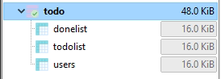
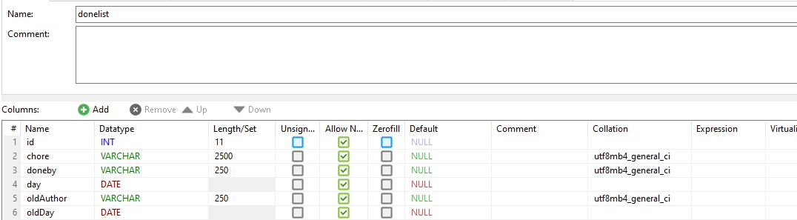
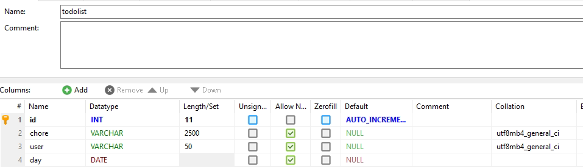
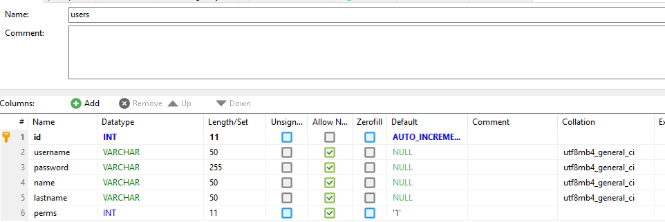

# Support To-do List
## Info
This is a website that has been made to help people do some chore's. There is nothing special about this perticular project but it's something that's singe-day made and I really liked the proccess. So let's go to see how it works.

## How it works
It's pretty simple you login with your credentials and then you can just write things on the field and they just stay there for ever `(Which is a problem that I'll solve in the next version... maybe...)`. To create another user account on the System you just click the Create Account button which is located to the bottom of the centered box. The credentials that you need to put to join are:
* Username: `admin`
* Password: `admin`


## Setup
To setup the website first you need to have setted up a webserver. If you haven't:
##### For Linux:
You just install the apache with the command:
```
sudo apt install apache2
```

Then you have to install the php so all you have to do is:
```
sudo apt install php8.1 php php-mysql -y
```

After the installation you just have to throw the files of the project into the path `/var/www/html/` and it's ready for this part. 
```
⚠ Now the website isn't ready and it won't show up when you try to open it because the database haven't been configured yet.
```

##### For Windows:
To setup the website all you have to do is install is the app **Xampp**. When you install it and run it you have to __**Start**__ the **Apache** and the **MySQL** server. After you do that then you press the button __Explorer__ and then a window will show app. When it show app all you have to do is go to `htdocs` files and create a folder there called `todo` then the only thing you have to do is to move all the files that are in the **`todo`- repository** to the `todo` file in your explorer.

### Database Configuration
Before you try to open your website you have to firstly install a database any type you want. After you install then you have to configure it this way:

* todo: *<- Database*
    * donelist *<- Table*
    * todolist *<- Table*
    * users *<- Table*




Now the tables must have those configurations:
* Donelist:


* To-Do List:


* Users:



So you can do your first login you have to go to users tables and put the following values:
* username: `admin`
* Password (`admin`):
`$2y$10$PUWb.6a90.VkkG17ss5MVuhW1wQJOq65qB7ywhmiO0haG1IABgWs.`
* Name: `<What ever you want>`
* Last Name: `<What ever you want>`
* Perms: `2`

After you put that you can hop on to a browser and log in with the credentials admin:admin. Then all you have to do is create an account through the Interface and then remove the admin account from the database and then you are ready.

### I Hoped you liked the proccess. I hope it was not that difficult. See you in the next version. 😉